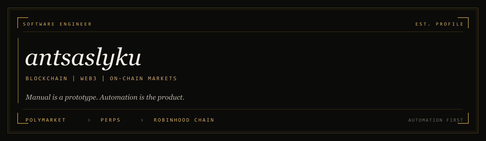
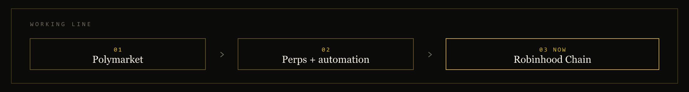

  

Software engineer specialised in **blockchain**, **web3**, and the software that sits between a market and a fill. I would rather ship a system than click a screen.

The public proof is on [Polymarket](https://polymarket.com/@antsaslyku) &mdash; short-horizon crypto markets, perpetual-style exposure, and the automation that made that repeatable. The current surface is **Robinhood Chain**: tokenized markets, EVM-native execution, first-wave infrastructure.

**Building** Robinhood Chain market systems &ensp;&middot;&ensp; **Known for** Polymarket execution &ensp;&middot;&ensp; **Bias** automate the second time

  

---

### now

Robinhood Chain is a permissionless Ethereum L2 (Arbitrum Orbit) built for tokenized equities, RWAs, and 24/7 on-chain markets. That is the chain I am here to take seriously &mdash; contracts, indexers, venue adapters, and the trading rails that belong on it from day one.

If a desk already works on Polymarket or perps, it should port. If it only works because someone is watching a UI, it is unfinished.

### practice

| Surface | What I actually build |
| :--- | :--- |
| **Prediction markets** | CLOB-aware execution, short-window crypto markets, position and risk loops on [Polymarket](https://polymarket.com/@antsaslyku) |
| **Perpetuals** | Venue-native perps, funding-aware automation, kill-switches instead of discretionary clicking |
| **Robinhood Chain** | Solidity on an EVM L2, Foundry / Hardhat deploys, indexers and trading surfaces for tokenized markets |
| **Automation** | Bots, feeds, replay, and ops tooling &mdash; the machine that replaces the ritual |

### how I work

- **Manual is a prototype.** The second time a flow is done by hand, it becomes a service.
- **Latency and correctness are the same problem** at market speed. Observable beats clever.
- **Prefer boring infrastructure.** Websockets, queues, risk limits, and replay over heroics.
- **Chain-native, venue-honest.** I model the exchange as it is &mdash; fees, ticks, funding, finality &mdash; not as a slide.

### stack

`TypeScript` &middot; `Solidity` &middot; `Python` &middot; `Rust`  
`Foundry` &middot; `Hardhat` &middot; `viem` &middot; `ethers` &middot; `wagmi`  
`Node.js` &middot; `Docker` &middot; `Postgres` &middot; `Redis`  
`EVM` &middot; `Arbitrum Orbit` &middot; `Robinhood Chain` &middot; `CLOB / perps`

### elsewhere

[X](https://x.com/antsaslyku) &ensp;&middot;&ensp; [Telegram](https://t.me/antsaslyku) &ensp;&middot;&ensp; [Polymarket](https://polymarket.com/@antsaslyku) &ensp;&middot;&ensp; [GitHub](https://github.com/antsaslyku)

antsaslyku &middot; software engineer &middot; on-chain markets
