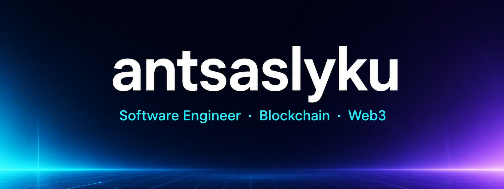

  

 

  

  
  
  
  

---

### About

Software engineer specialised in **blockchain**, **web3**, and on-chain markets. I build the systems that sit between a signal and a fill &mdash; then I automate them so nobody has to click twice.

- Public track record on **[Polymarket](https://polymarket.com/@antsaslyku)** &mdash; short-horizon crypto markets, perps-style exposure, execution loops
- Now focused on **Robinhood Chain** (Arbitrum Orbit L2) &mdash; tokenized markets, contracts, indexers, trading rails
- Bias: if a flow is done twice by hand, it becomes a machine

### Currently

Building first-wave infrastructure on **Robinhood Chain** &mdash; EVM-native, 24/7 markets, tokenized equities / RWAs. Same execution discipline that worked on Polymarket, ported to a new chain.

### What I build

| | | |
|:---:|:---:|:---:|
| **Prediction markets** | **Perpetuals** | **Robinhood Chain** |
| CLOB execution, short-window crypto, risk loops | Venue-native perps, funding-aware bots, kill-switches | Solidity, Foundry / Hardhat, indexers, trading surfaces |
| **Automation** | **Market infra** | **On-chain** |
| Feeds, replay, ops tooling | Latency, queues, observability | EVM, Arbitrum Orbit, RWAs |

### Stack

  

 

`TypeScript` `Solidity` `Python` `Rust` `Foundry` `Hardhat` `viem` `ethers` `wagmi` `Node.js` `Docker` `Postgres` `Redis`

### GitHub

  
  

  

  

### Connect

  <a href="https://x.com/antsaslyku">X @antsaslyku</a>
  &nbsp;&middot;&nbsp;
  <a href="https://t.me/antsaslyku">Telegram @antsaslyku</a>
  &nbsp;&middot;&nbsp;
  <a href="https://polymarket.com/@antsaslyku">Polymarket</a>

  

